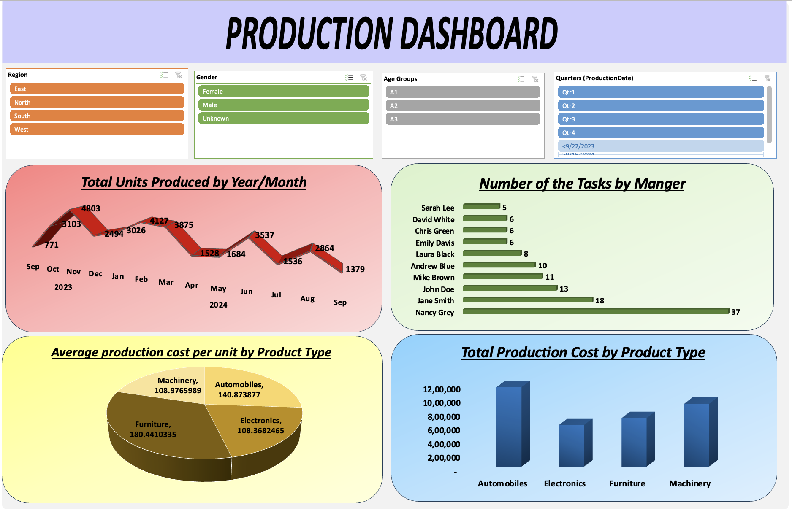

# Production Performance & Cost Analysis Dashboard



## Project Overview

This project is an **Excel-based Production Performance & Cost Analysis Dashboard** created to analyze production volume, production costs, manager task distribution, and product-type performance.

The dashboard uses interactive slicers for **Region, Gender, Age Groups, and Quarter**.

## Dataset Overview

- **Records:** 120
- **Date range:** 22 September 2023 – 14 September 2024
- **Total units produced:** 34,727
- **Total production cost:** ₹33,71,078
- **Overall average production cost per unit:** 132.3923509
- **Product types:** Automobiles, Electronics, Furniture, Machinery
- **Regions:** East, North, South, West

## Dashboard Filters

| Filter | Values |
|---|---|
| Region | East, North, South, West |
| Gender | Female, Male, Unknown |
| Age Groups | A1, A2, A3 |
| Quarter | Qtr1, Qtr2, Qtr3, Qtr4 |

## Dashboard Components

### 1. Total Units Produced by Year/Month

The line chart shows production volume from September 2023 through September 2024.

| Period | Units |
|---|---:|
| Sep 2023 | 771 |
| Oct 2023 | 3,103 |
| Nov 2023 | 4,803 |
| Dec 2023 | 2,494 |
| Jan 2024 | 3,026 |
| Feb 2024 | 4,127 |
| Mar 2024 | 3,875 |
| Apr 2024 | 1,528 |
| May 2024 | 1,684 |
| Jun 2024 | 3,537 |
| Jul 2024 | 1,536 |
| Aug 2024 | 2,864 |
| Sep 2024 | 1,379 |

### 2. Number of Tasks by Manager

| Manager | Tasks |
|---|---:|
| Nancy Grey | 37 |
| Jane Smith | 18 |
| John Doe | 13 |
| Mike Brown | 11 |
| Andrew Blue | 10 |
| Laura Black | 8 |
| Emily Davis | 6 |
| Chris Green | 6 |
| David White | 6 |
| Sarah Lee | 5 |

### 3. Average Production Cost per Unit

| Product Type | Average Cost per Unit |
|---|---:|
| Automobiles | 140.8738769541 |
| Electronics | 108.3682465167 |
| Furniture | 180.4410334878 |
| Machinery | 108.9765989464 |

### 4. Total Production Cost by Product Type

| Product Type | Total Cost | Units Produced | Records |
|---|---:|---:|---:|
| Automobiles | ₹11,52,805 | 13,137 | 46 |
| Machinery | ₹9,10,416 | 9,409 | 30 |
| Furniture | ₹7,03,282 | 5,274 | 19 |
| Electronics | ₹6,04,575 | 6,907 | 25 |

## Data Preparation

The workbook contains two derived fields:

```excel
Age Groups = IF(True Age<=35,"A1",IF(True Age<=45,"A2","A3"))
```

```excel
Production Cost Per Unit = TotalCost / UnitsProduced
```

## Analysis Map

| Business Question | Analysis | Visualization |
|---|---|---|
| How many units are produced over time? | Monthly production | Line chart |
| How are tasks distributed among managers? | Task count by manager | Horizontal bar chart |
| Which product type has the highest average unit cost? | Average cost per unit | Pie chart |
| How does total production cost vary by product type? | Total production cost | Column chart |
| How can results be segmented? | Region, Gender, Age Group, Quarter | Slicers |

## Key Insights

- Total production is **34,727 units**.
- Total production cost is **₹33,71,078**.
- Automobiles has the highest total production cost at **₹11,52,805**.
- Furniture has the highest average production cost per unit.
- Electronics has the lowest average production cost per unit.
- November 2023 has the highest monthly production shown, with **4,803 units**.
- Nancy Grey has the highest task count, with **37 tasks**.
- West has the largest number of records, with **55 records**.
- Qtr1 has the largest displayed quarter record count, with **40 records**.

## Excel Techniques Used

- Data preparation
- IF formulas
- Basic calculated fields
- Pivot Tables
- Pivot Charts
- Slicers
- Date grouping
- Sum, Count, and Average calculations
- Dashboard design
- Data visualization

## Business Value

The dashboard provides a single visual report for:
- Production monitoring
- Cost comparison
- Manager workload analysis
- Product-type performance
- Regional and demographic filtering
- Business reporting

## Project Structure

```text
production-performance-cost-dashboard/
│
├── dashboard_preview.png
├── Production dashboard.xlsx
└── README.md
```

## Skills Demonstrated

**Microsoft Excel | Data Analysis | Pivot Tables | Pivot Charts | Slicers | Data Visualization | Dashboard Design | Business Reporting | Excel Formulas**

## Author

Created as an Excel Data Analytics portfolio project.
